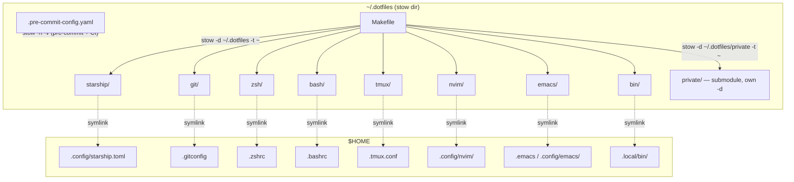
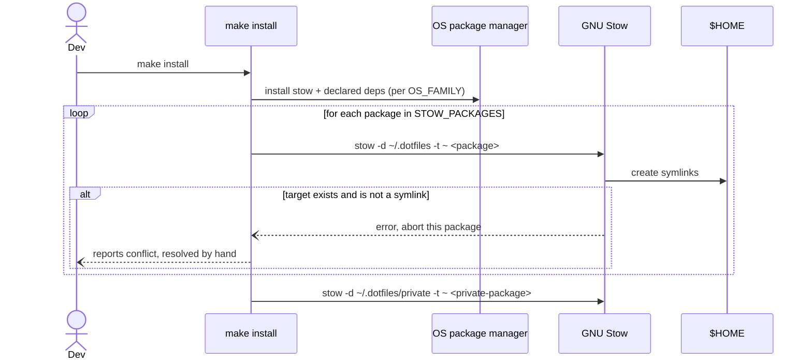
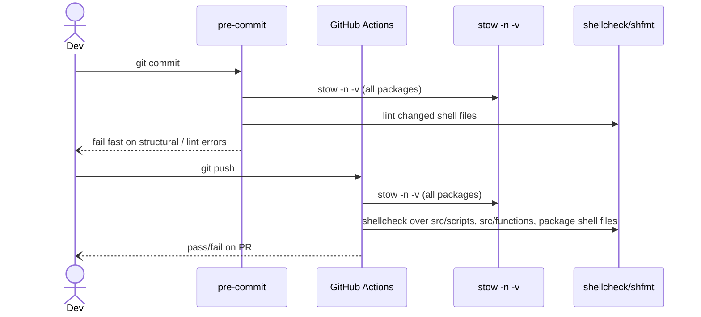

# Architecture: Dotfiles Refactor to GNU Stow

Source: `docs/trd-stow-refactor.md` (filled via collaborative Q&A), verified
against the current repo tree. This document translates the TRD's decisions
into an implementable plan. It does not re-decide anything the TRD already
settled; where the TRD's decisions conflict with what's actually in the repo,
or leave a mechanism unspecified, that's called out under **Key Decisions**
or **Open Questions / Gaps**, not silently resolved.

## Context

The dotfiles repo currently manages symlinking, OS package installs, and tool
bootstrapping through hand-written Makefile targets (`makefiles/shells.mk`,
`editors.mk`, etc.) that call `ln -sf` directly. This makes file ownership
ambiguous (is a config's home `config/`, `src/`, or `private/`?) and means
every new tool needs new Makefile plumbing. GNU Stow replaces the symlinking
layer: one directory per tool ("package"), mirroring `$HOME`'s layout inside
it, linked in with `stow -d ~/.dotfiles -t ~ <package>`. This pass migrates
the linking mechanism and prunes dead files found along the way; it does not
change which tools are managed (per TRD §2 non-goals) or reorganize
`private/` internals (deferred).

## Component Breakdown

Each top-level directory under the repo root is a stow package mirroring the
part of `$HOME` it owns. `make install` is the only orchestration entry
point: it installs `stow` + OS deps, then runs `stow -d ~/.dotfiles -t ~
<pkg>` per package in the detected OS's package set. `private/` keeps its
current status as a git submodule but is stowed from its own `-d
~/.dotfiles/private`, independently of the public packages. `.pre-commit-config.yaml`
and CI both run `stow -n -v` (dry-run) as a structural check, not an install
step.

## Data Flow

`make install` is idempotent: re-running it re-runs `stow` for every package,
which is a no-op if links already exist and errors (not silently overwrites)
if a real file is in the way. There is no backup/rollback step by design
(TRD §5) — conflicts are surfaced, not auto-resolved.

Both pre-commit and CI run the same dry-run check so structural mistakes
(conflicting targets, malformed package dirs, e.g. a package missing its
mirrored subdirectory) are caught before commit and re-verified before
merge. This replaces the current `.github/workflows/make-stages.yaml` jobs
(`emacs`, `make shells`, `make kubernetes`) which hand-roll symlinks and
exercise OS package installs, not structural correctness of the dotfiles
layout itself. See Key Decisions for how that workflow is expected to
change.

## Key Decisions

### Decision: One package per tool, repo root as stow dir
- **Decision:** No `packages/` subdirectory; every top-level dir in the repo
  is passed directly as a package to `stow -d ~/.dotfiles -t ~ <pkg>`.
- **Rationale:** Matches TRD §4 exactly; keeps the mental model flat —
  "the top level of the repo is the package list."
- **Alternatives Considered:** A `packages/` wrapper dir (common in other
  stow-based dotfiles) — rejected as an unnecessary layer per the KISS goal
  in TRD §2.

### Decision: `bin` package scope is executable scripts only, not sourced functions
- **Decision:** `src/scripts/*.sh` (executable, shebanged, currently invoked
  via `config/aliases` with an absolute path) become the `bin` package,
  symlinked into a directory on `$PATH` (e.g. `~/.local/bin`).
  `src/functions/*.sh` (currently sourced by a loop in `zshrc`/`bashrc`, not
  executed standalone) do **not** move into `bin` — they stay sourced,
  either folded into the `zsh`/`bash` package's own directory or given a
  dedicated `functions` package that the shell rc file sources by path.
- **Rationale:** Putting a file on `$PATH` only helps if it's meant to be
  *executed*; the functions in `src/functions/` are meant to be *sourced*
  into the current shell (they define shell functions/aliases that need to
  run in-process). Folding both into one `bin` package targeting `$PATH`
  (as TRD §4 currently phrases it) doesn't match how either group is
  actually invoked today.
- **Alternatives Considered:** Keep TRD §4's literal wording (both
  `functions/` and `scripts/` under one `bin` package on `$PATH`) — rejected
  because it would silently break every function currently sourced by the
  shell rc loop; they'd land on `$PATH` but never get sourced. Flagged in
  Open Questions below rather than decided unilaterally, since it changes a
  mechanism the TRD didn't explicitly discuss.

### Decision: `git` package scope needs a decision, not just a move
- **Decision:** Deferred to the user — see Open Questions. No `.gitconfig`
  or `.gitignore_global` file exists in the repo today; `makefiles/git.mk`'s
  `git-config` target sets user.name/user.email imperatively via `git
  config --global`. TRD §4 names `.gitconfig`/`.gitignore_global` as the
  `git` package's contents, which requires creating dotfiles that don't
  exist yet — a real (small) design decision, not a pure move.
- **Rationale:** Flagging rather than guessing, per the kickoff principle
  "ask before assuming" — whether to introduce a real `.gitconfig` is a
  scope call the TRD didn't make explicitly.
- **Alternatives Considered:** Skip the `git` package entirely this pass and
  leave `make git-config` as an imperative target outside stow — viable, but
  contradicts TRD §4 which lists `git` as an in-scope package. Needs the
  user's call.

### Decision: CI workflow is replaced, not extended
- **Decision:** `.github/workflows/make-stages.yaml`'s `emacs` job (which
  hand-symlinks `config/emacs/init.el` to validate it loads) and the
  `make shells` / `make kubernetes` steps in the `make` job are removed once
  the corresponding packages migrate. A new `stow` job runs `stow -n -v`
  across all packages on every push (TRD §8). The emacs *content* validation
  (does `init.el` actually load in batch mode) has no direct stow
  equivalent — dry-run only checks link structure, not that the config
  parses — so either that emacs-load check is kept as a separate job
  against the new package path, or it's dropped per TRD §8 ("no smoke test
  beyond dry-run + shellcheck in this pass"). Flagged in Open Questions.
- **Rationale:** The existing jobs test the *old* symlink mechanism
  end-to-end; once stow owns linking, those jobs test nothing meaningful and
  should not linger as dead CI.
- **Alternatives Considered:** Keep old jobs running in parallel until the
  full migration completes — rejected; TRD §7 already commits to migrating
  and verifying (§8) each package independently before moving on, so CI
  should track that package-by-package, not lag behind in one big batch.

### Decision: Makefile shrinks to detection + orchestration only
- **Decision:** `makefiles/base.mk`'s OS-detection variables
  (`OS_FAMILY`, `IS_ARCH`, `IS_DEBIAN`, `IS_MACOS`) survive — they're not
  symlinking logic. `makefiles/shells.mk`, `editors.mk`'s symlink recipes,
  and `backup.mk` are deleted outright per TRD §5 (no automated backup;
  stow replaces linking). A single `install` target computes the
  OS-appropriate `STOW_PACKAGES` list and loops `stow` over it.
  `makefiles/tools.mk`, `kubernetes.mk`, `wayland.mk`, `distros/*.mk`
  (OS package installs unrelated to symlinking) are out of scope for this
  refactor's *deletion* mandate but should be reviewed for staleness anyway
  during the §3 audit, since some targets there (see Open
  Questions/Gaps) already look broken or duplicated independent of stow.
- **Rationale:** TRD §5 is explicit that the Makefile "shrinks to
  orchestration only... whatever's left... collapses into a much smaller
  Makefile," but the boundary between "linking logic" (deleted) and
  "everything else" (kept, but not necessarily untouched) needs to be drawn
  somewhere concrete — this is that line.
- **Alternatives Considered:** Delete all of `makefiles/*.mk` and start a
  flat `Makefile` from scratch — more thorough but riskier and out of scope;
  the TRD only mandates removing the *symlinking* logic, not re-auditing
  every OS-install target in the same pass (that's a separate, larger
  cleanup the §3 audit can flag candidates for, without this refactor
  executing all of them).

### Decision: `private/` stays a git submodule, gets its own `-d`
- **Decision:** `private/` is confirmed (via `.gitmodules`) to already be a
  git submodule today. TRD §4's "cloned alongside/under `~/.dotfiles`" is
  read as *keeping* the existing submodule relationship, not replacing it
  with a separate top-level clone — `stow -d ~/.dotfiles/private -t ~
  <private-package>` runs against the submodule's checkout path.
- **Rationale:** Least-change reading of an ambiguous TRD phrase, consistent
  with §2's non-goal ("not refactoring private/ internals... just how it's
  linked in").
- **Alternatives Considered:** Un-submodule `private/` and clone it as a
  sibling directory outside `~/.dotfiles` — bigger structural change than
  the TRD signals it wants; not pursued without explicit confirmation
  (listed in Open Questions since "cloned alongside/under" is genuinely
  ambiguous between the two readings).

## Tech Stack & Dependencies

- **GNU Stow** — not currently installed on the primary machine (`stow
  --version` returns nothing); `make install` must install it as a
  first step, per-OS (e.g. `pacman -S stow`, `apt install stow`, `brew
  install stow`).
- **GNU Make** — existing orchestration tool, retained.
- **pre-commit** (existing: `trailing-whitespace`, `end-of-file-fixer`,
  `check-yaml`, `check-merge-conflict`, `check-added-large-files`,
  `shellcheck`) — extended with a `stow -n -v` local hook and (optionally)
  `shfmt`.
- **shellcheck-py** (existing pre-commit hook) — scope extended to
  `src/scripts/`, `src/functions/`, and any package's shell files.
- **GitHub Actions** — existing `.github/workflows/make-stages.yaml`,
  reworked per the CI decision above.
- **git submodules** — `private/` remains one.
